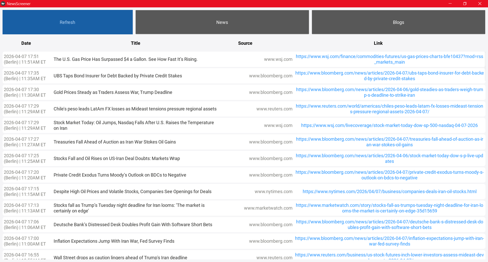

# NewsScreener

NewsScreener is a lightweight desktop app for aggregating financial and geopolitical news in real time. It's designed for traders, analysts, and anyone who needs a clear picture of the market without unnecessary visual clutter.

Key Features

1) Instant Monitoring: Collects fresh headlines from key financial sources (Bloomberg, Yahoo Finance, WSJ, MarketWatch, etc.).
2) Separate Streams: Separate tabs for official news (News) and editorial analysis (Blogs).
3) Direct Links: Quickly jump to the full text of an article with one click.
4) Minimalistic UI: An interface that doesn't distract from the essence of the data.

Technological aspects
The project is built on modern Python (3.11) solutions to ensure speed and cross-platform compatibility:

GUI Framework: [Kivy](https://kivy.org/).

Data processing: [pandas](https://pandas.pydata.org/).

Data Sourcing:[finvizfinance](https://pypi.org/project/finvizfinance/).
